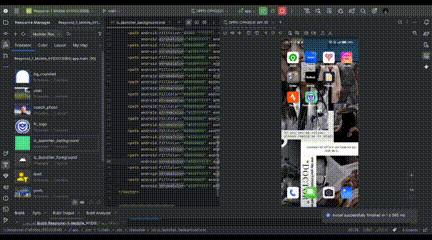

# Club Bola Portsmouth FC

```js
Nama        : Imedia Sholem Shoukat,
NIM         : H1D023088,
shift baru  : C,
shift asal  : D, 
```

## Penjelasan
Aplikasi ini menampilkan informasi tim sepak bola, termasuk detail pemain dan pelatih, dengan data diambil dari API. Data ditampilkan secara dinamis menggunakan RecyclerView dan data binding.

### Alur Data
1. Pemanggilan API
- Retrofit Instance dibuat di RetrofitInstance.kt.
- Interface FootBallAPI mendefinisikan endpoint, misal:
```
@GET("teams/325")
suspend fun getTeam(): Response
```
- TeamViewModel memanggil getDetailTeam() untuk mengambil data.

2. Proses Data di ViewModel
- TeamViewModel menjadi perantara antara API dan UI.
- Data dimasukkan ke dalam LiveData.
- Error dikemas dalam Result.failure() untuk penanganan di UI.

3. Observasi Data di Activity / Fragment
- Activity mengamati LiveData dari ViewModel.
- Menggunakan data binding untuk menampilkan data coach/pemain.

4. Penyajian Data di Layar
- Detail Coach: ditampilkan di TextView (tvFullName, tvName, tvDateOfBirth, dll).
- Daftar Pemain: menggunakan RecyclerView dengan PlayerAdapter.
- Posisi pemain menentukan warna card.

Item bisa diklik memanggil callback OnPlayerClickListener.

### Ringkasan Alur Data
Retrofit API -> TeamViewModel -> LiveData -> Activity/Fragment -> RecyclerView/DataBinding -> UI

### Error Handling
- Network error ditangani di ViewModel.
- Null data dicek sebelum diisi ke UI, aplikasi tidak crash.
- Pesan error atau placeholder ditampilkan jika data tidak tersedia.

## Video demo
